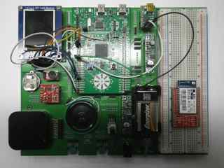

# Brick-Breaker
The final project for my computer structures class in the Spring of 2016.

As a final project we were tasked with building a game that would run on the boards we had been developing drivers for and experimenting with all semester
I worked with a partner to take an version of the game pong that had been used in a pervious assignment in class and use it as the basis for our brick break game. While the game can't run without the board I did want to put my code up here to be observed, maybe I'll eventually get around to developing a way for it to run standalone. 
